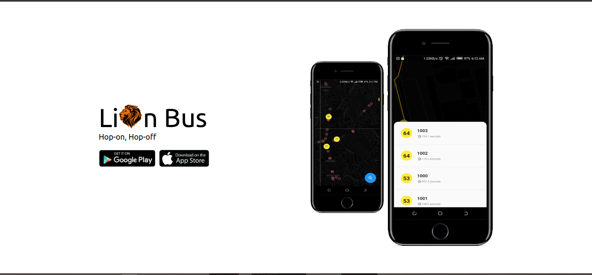
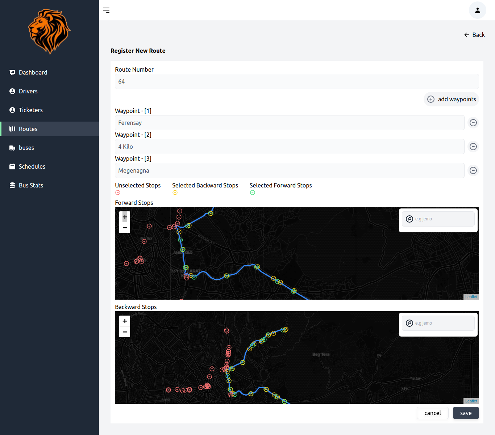
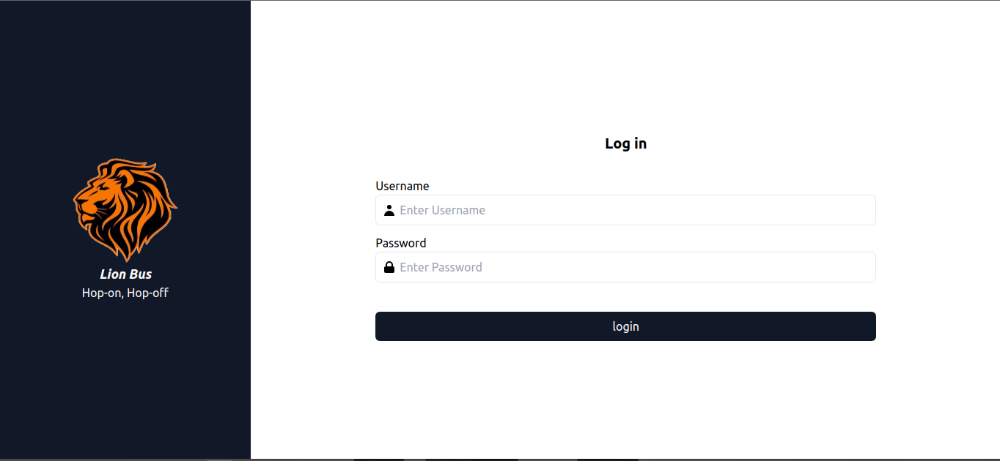
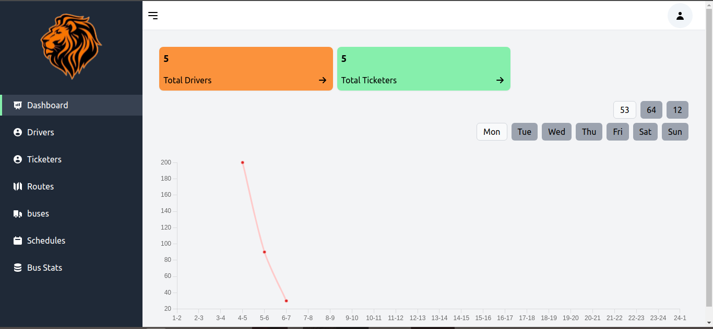
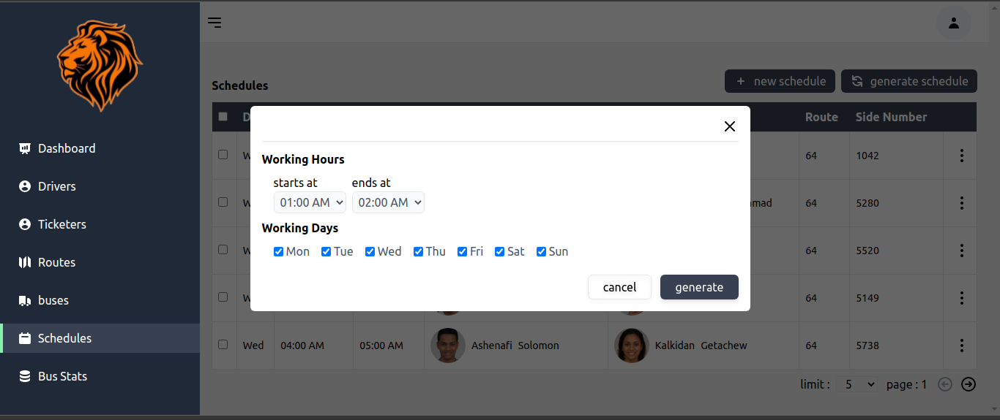

Online Tracking And Scheduling System For City Bus
=====
Team members
----

Bethelhem Gebremariam 
Eyosiyas Girma                 
Moti Hatew  
Yomiyu Wakweya  
Zerihun Abune  

Advisor
---
Mr Hizkel

Summary
---
Currently, transit bus providers use handheld transceivers for communication which itself is inefficient. 
Commuters on the other side have no communication and knowledge on the whereabouts of buses. 
They solely rely on routines that are learned by trial and error and on responses other familiar commuters provide. 
Overall, there are no comprehensive systems that satisfy commuters' needs. Our project aims to solving this gaps. 
It automates scheduling using previous datas and allow commuters to see the wareabouts of buses.

Tools and Technologies
---
React.js  
OpenStreetMap  
OSRM  
VS-Code  

Installation and Setup
---

1. Run `npm install` command at the root of the project to install dependencies and node_modules folder will be created.
2. Run `npm start`
